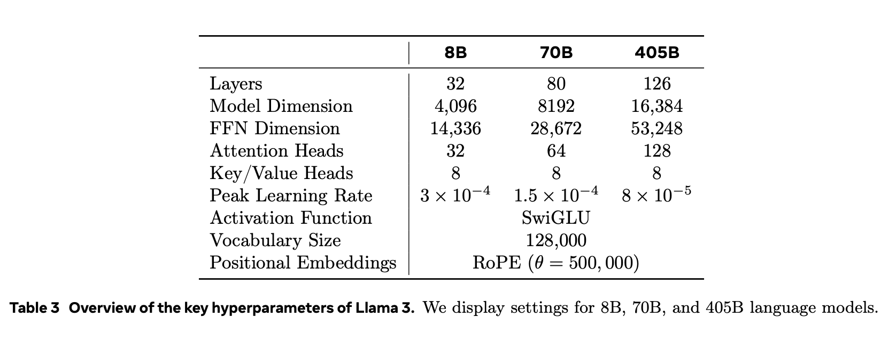
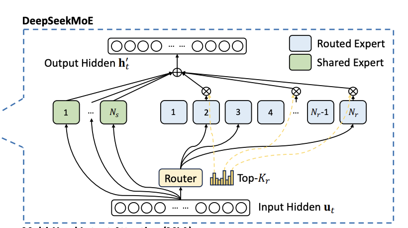
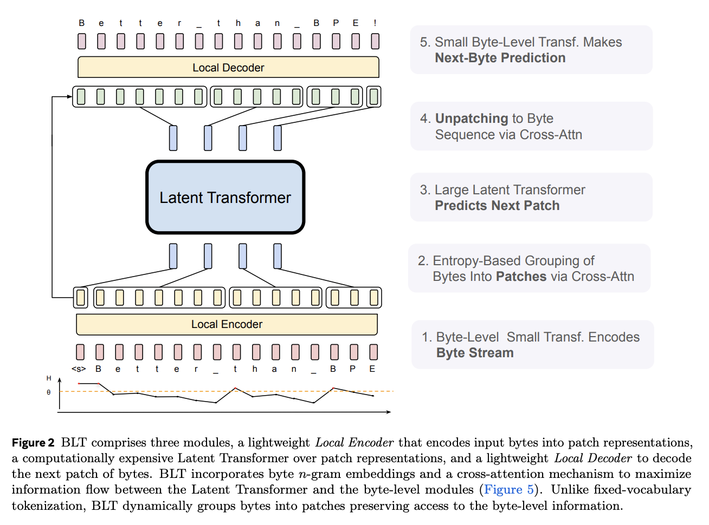
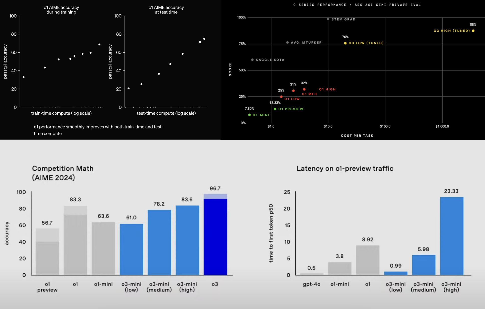
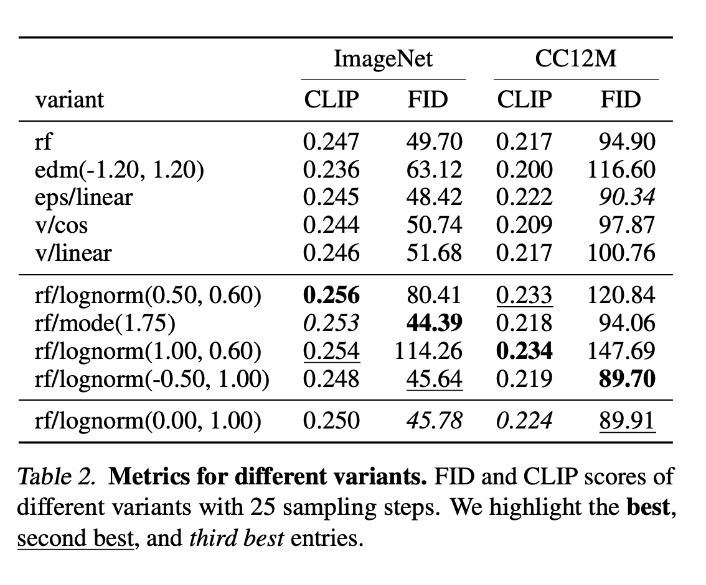
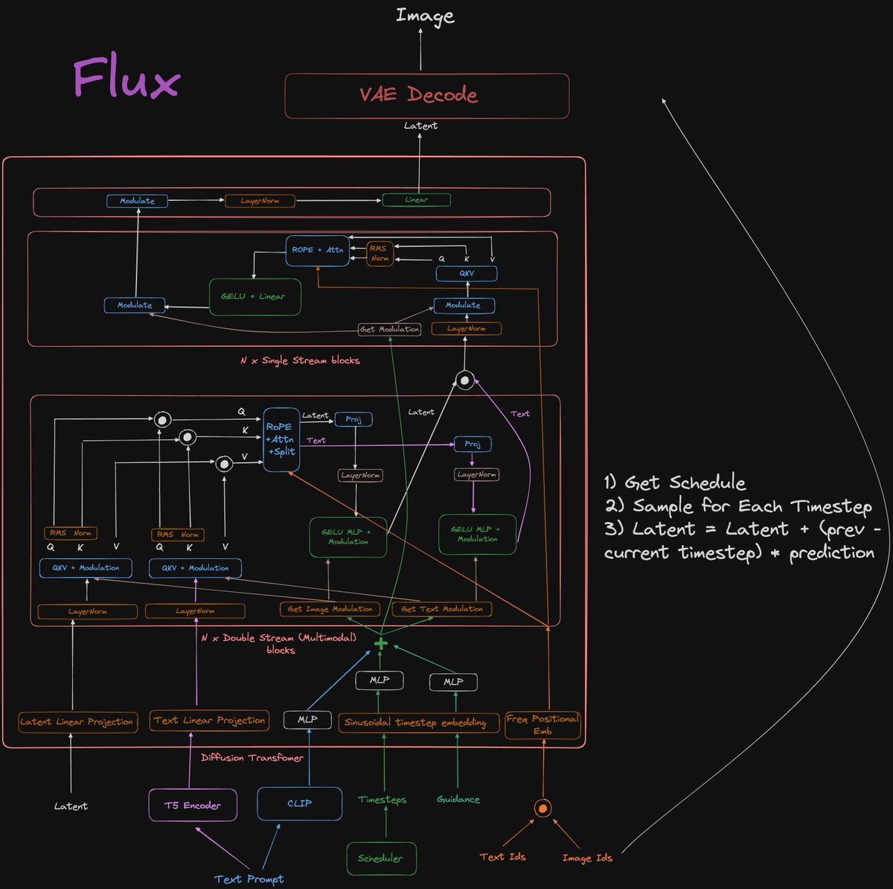
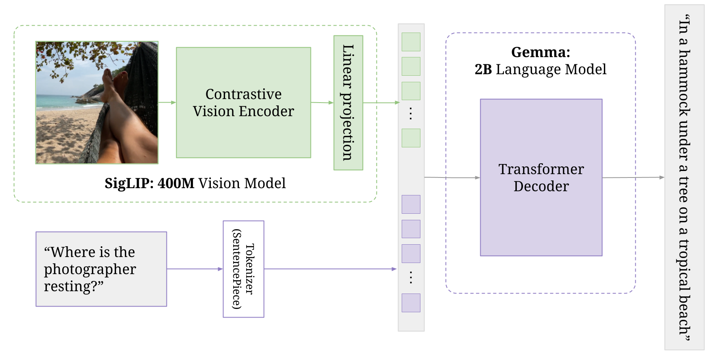
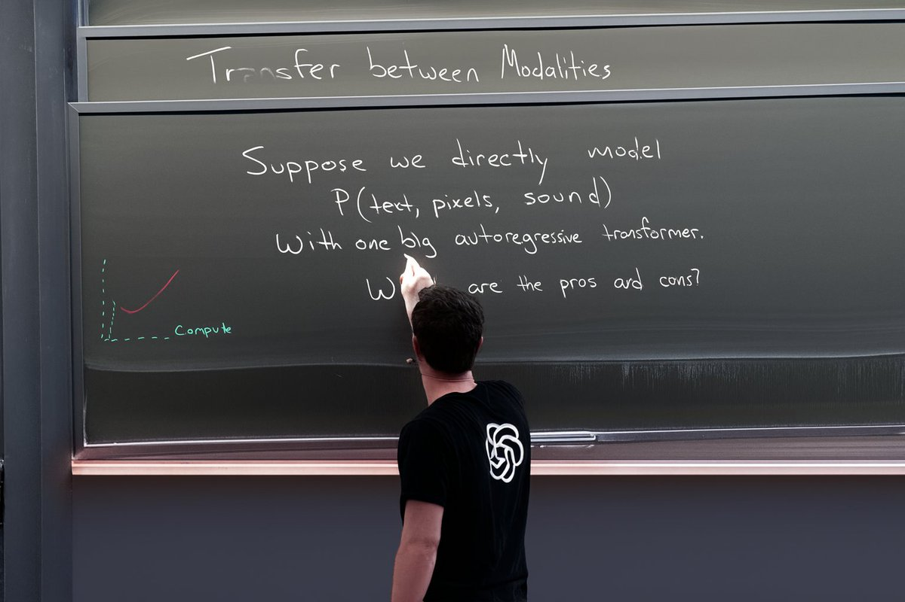
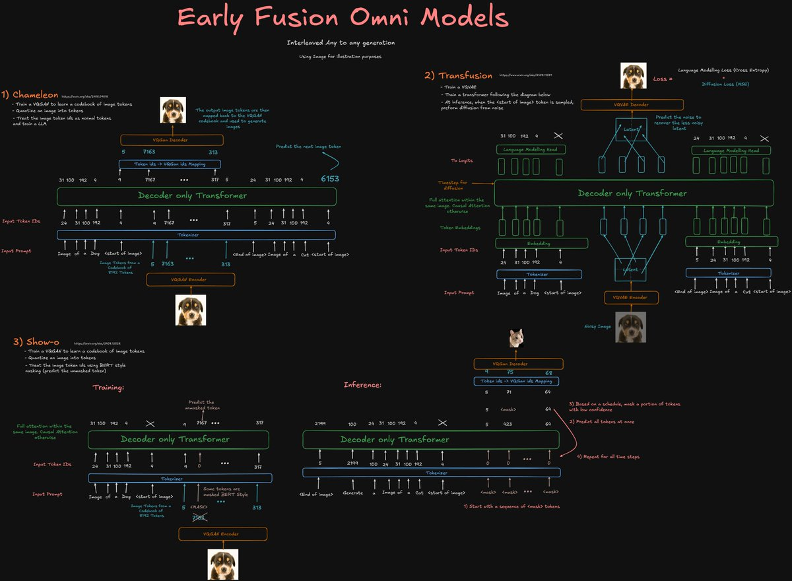

+++
title = 'The State of Generative Models'
date = 2024-12-30
[params]
subtitle = "A 2024 Review"
+++
# The State of Generative Models
{}

    

        In the face of disruptive technologies, moats created by closed source are temporary.
          
        Even OpenAI’s closed source approach can’t prevent others from catching up. 
         
        So we anchor our value in our team — our colleagues grow through this process, 
         
        accumulate know-how, and form an organization and culture capable of innovation. 
         
        That’s our moat.
  

  

    -
  Liang Wenfeng, CEO of DeepSeek
  

2024 has been a great year for AI. In both text and image generation, we have seen tremendous step-function like improvements in model capabilities across the board. A year that started with OpenAI dominance is now ending with Anthropic's Claude being my used LLM and the introduction of several labs that are all attempting to push the frontier from xAI to Chinese labs like DeepSeek and Qwen.

The past 2 years have also been great for research. While much of the progress has happened behind closed doors in frontier labs, we have seen a lot of effort in the open to replicate these results. In this post, I share what I think the current state of generative models is, as well as research directions that I am personally excited for in 2025. 

# Language 
Large Language Models are undoubtedly the biggest part of the current AI wave and is currently the area where most research and investment is going towards. This year we have seen significant improvements at the frontier in capabilities as well as a brand new scaling paradigm.

## Architecture 
While we have seen attempts to introduce new architectures such as [Mamba](https://arxiv.org/abs/2312.00752) and more recently [xLSTM](https://arxiv.org/abs/2405.04517) to just name a few, it seems likely that the decoder-only transformer is here to stay - at least for the most part. 

### Dense Transformer
The current "best" open-weights models are the Llama 3 series of models and Meta seems to have gone all-in to train the best possible vanilla Dense transformer. Dense transformers across the labs have in my view, converged to what I call the [Noam Transformer](https://gist.github.com/nreHieW/a4ae05d216c5326c9fb9a70fcdda3274) (because of Noam Shazeer). This is essentially a stack of decoder-only transformer blocks using [RMSNorm](https://arxiv.org/abs/1910.07467), [Group Query Attention](https://arxiv.org/abs/2305.13245), some form of [Gated Linear Unit](https://arxiv.org/abs/2002.05202) and [Rotary Positional Embeddings](https://arxiv.org/abs/2104.09864). Optionally, some labs also choose to interleave sliding window attention blocks.

  
  
Llama 3 Architecture

 

Amongst all of these, I think the attention variant is most likely to change. Specifically, DeepSeek introduced [Multi Latent Attention](https://arxiv.org/abs/2405.04434) designed for efficient inference with KV-cache compression. DeepSeek has only really gotten into mainstream discourse in the past few months, so I expect more research to go towards replicating, validating and improving MLA. There has also been some research towards hybrid designs (replacing every $k$ transformer block with a State-Space-Model) with the hopes that we get more efficient inference without any quality drop. 

A more speculative prediction is that we will see a RoPE replacement or at least a variant. While RoPE has worked well empirically and gave us a way to extend context windows, I think something more architecturally coded feels better asthetically. I have 2 reasons for this speculation. First, [Cohere's new model](https://huggingface.co/CohereForAI/c4ai-command-r7b-12-2024) has no positional encoding in its global attention layers. The fact that this works at all is surprising and raises questions on the importance of position information across long sequences. Second, when DeepSeek developed MLA, they needed to add other things (for eg having a weird concatenation of positional encodings and no positional encodings) beyond just projecting the keys and values because of RoPE. If MLA is indeed better, it is a sign that we need something that works natively with MLA rather than something hacky. 

### Mixture-of-Experts 
2024 has also been the year where we see Mixture-of-Experts models come back into the mainstream again, particularly due to the rumor that the original GPT-4 was 8x220B experts. In the open-weight category, I think MOEs were first popularised at the end of last year with Mistral's [Mixtral](https://mistral.ai/news/mixtral-of-experts/) model and then more recently with DeepSeek [v2](https://arxiv.org/abs/2405.04434) and [v3](https://arxiv.org/abs/2412.19437). The unfortunate thing about MOEs is that they aren't easy to serve for most people (DeepSeek v3 can't be used with 8xH100) but I personally have a lot of faith in the DeepSeek team in pushing MOEs to the frontier. 

  
  
DeepSeek Mixture-of-Experts Architecture 

 

Specifically for future research, I am personally looking forward to architectural ablations such as different routing mechanisms, handling instabilities in routing and even if every single layer needs to be MoE or would it be better for the first few layers to be dense. I would also like to see more interpretabilty work here if MoEs are here to stay, specifically the answer to the question: **"So do we want our experts to specialize in human-understandable domains/ways or not?"**

> *On the topic of architectural ablations, I would also like to see more research both theoretical and empirical into the depth vs width discussion. I personally think depth is the way to go but I suspect for small models, especially on edge devices, the formula might be different. (See [MobileLLM](https://arxiv.org/abs/2402.14905))*

## Tokenization 
Tokenization, specifically Byte Pair Encoding, has long been one of those things that everyone dislikes but no one has a better solution for and it hasn't led to big problems so we just leave it as is. The ["How many R's in strawberry" problem](https://x.com/polynoamial/status/1864735835607962051) arguably has roots in tokenization and it is unclear if current 3-digit splits of numbers are doing anything to math performance. In December, we saw a few papers from Meta that finally seem to indicate a move away from current Tokenization methods. Specifically, doing Chain-of-Thought in latent space [[1](https://arxiv.org/abs/2412.06769)] and training a transformer over bytes [[2](https://ai.meta.com/research/publications/byte-latent-transformer-patches-scale-better-than-tokens/)] are the 2 that seem the most promising and I hope we see Meta continue in this direction in 2025.

I am particularly interested in the [Byte Latent Transformer](https://ai.meta.com/research/publications/byte-latent-transformer-patches-scale-better-than-tokens/) paper because I think the solution the team came up with to handle byte inputs - using the encoder/decoder setup and splitting based on entropy - is extremely intriguing. Personally, my main open question/concern here is on the quality of the byte decoder. Intuitively, it seems to be the quality bottleneck (going from patches back to bytes) but it is not easy to scale up this decoder since it's modelling entire sequences of bytes. 

  
  
Byte Latent Transformer Architecture 

## Reasoning
Reasoning has been a huge topic towards the second half of the year with the release of o1 and more recently o3 showing improvements in model reasoning capabilities on Math, Science and Coding tasks, the speed of which many did not expect. While OpenAI did not release the underlying research beyond the [blog post examples](https://openai.com/index/learning-to-reason-with-llms/) and that they used Reinforcement Learning somewhere, we have begun seeing replications specifically [DeepSeek's r1](https://api-docs.deepseek.com/news/news1120) and [Qwen's QwQ/QvQ](https://qwenlm.github.io/blog/qvq-72b-preview/) models.

  
  
OpenAI's o1 and o3 models on several reasoning benchmarks

 

Behind these breakthroughs is a new scaling paradigm: "inference-time compute". At its core, this refers to a model that 1) generates longer Chain of Thought (CoT) than normal (potentially in the millions of tokens) and 2) is able to effectively use and reason over this CoT. If we look at the CoT traces of these models however, they all share a common set of characteristics: 
- They reason in clear stages demarcated usually by new lines.
- They often use "pivot words" such as "Alternatively", "But". Such backtracking and branching behavior appears less in standard LLM generations.
- They work superbly well on domains with external verifications (there is a ground truth such as in Math and Code) but less so on domains like creative writing. 
- Sometimes they have weird spelling and capitalization and would even change languages midway. (This is probably explained by RL)

There are many theories and rumors about the recipe behind the o-series models and while we wait for a paper from DeepSeek on r1 or Qwen on QwQ, I'll share mine here. I think OpenAI took the simplest most straightforward bitter lesson route. Following their [Lets Verify Step by Step paper](https://arxiv.org/pdf/2305.20050), I think they trained a bunch of Process Reward Models (PRMs) to give a reward value for each stage of the reasoning along with any external verifiers as necessary (code test cases etc). They then generated a bunch of synthetic data (with something like [this](https://arxiv.org/abs/2310.04363)) and did RL (probably [PPO](https://arxiv.org/abs/1707.06347)) on it. The pivot words are naturally learned by the RL process and are not hard coded in. 

> *I am aware that this is all very 'handwavy' and probably an oversimplification but I really do think the Lets Verify Step by Step paper is 70% of the wor.k*

In 2025, I think that it is likely that we see an Anthropic reasoner but also that this inference time compute paradigm can be scaled up alot more which gives the open-source community (and other labs) a lot of room to catch up. OpenAI going from o1 to o3 in 3 months should be indicative of this. 

***A note on search (MCTS etc):** 
 
Based on how o1 generates its answer, I doubt that OpenAI uses some form of inference time search. They probably did use some form of search to generate their synthetic data though (Meta explains this too in their Llama 3 paper). o1-pro mode is a completely different story. OpenAI has confirmed that the underlying model is the same and given that this doesn't stream, search is probably used.*

On Post Training in general, I hope we don't just fixate on STEM reasoning post training. By now, we have established that RL on external verifiers works both with o1 and most recently with [Allen AI](https://allenai.org/blog/tulu-3-technical). I hope we find something that similarly improves on RLHF but in more open domains. I won't count out RL but what a reward will look like for these domains is not obvious to me. Hopefully, we have a way to post-train alignment without messing too much with the base model weights.

## Distillation
1 thing significant about the o1 release was that OpenAI hid the actual CoT from users to prevent people from training the outputs. DeepSeek has publicly confirmed that DeepSeek v3 was trained on DeepSeek's r1 outputs and they show in the paper that it helps performance, which explains OpenAI's decision. We can see traces of this distillation in v3's outputs but interestingly, it doesn't actually generate super long CoT like a reasoner would and seems to have different ["modes"](https://x.com/nrehiew_/status/1872729152954220988) - reasoner mode for reasoning tasks and normal outputs for normal tasks. 

This might not seem that surprising but I find it pretty interesting. We see that o1 still goes into its CoT spiel when given a creative writing domain task but DeepSeek v3 seems to have an internal prompt classifier of sorts to determine the mode it is in. This is the sort of problem ripe for Mechanistic Interpretability for example training a linear probe to classify the nature of a prompt and comparing the performance on a model distilled on a reasoner and one that is not. In 2025, I also hope that we see more research into what actually happens when we distill on a reasoner and hopefully we get more reasoners that the open source community can distill from. 

Another question I have in this regard is GPT-4o-mini and o1-mini. These 2 models are significantly smaller than their original but have extremely small quality degradation. o1-mini in particular seems to retain a large part of o1-preview's reasoning capabilities. I hope that we will soon find out if OpenAI has a secret distillation technique or it just comes down to a clean pipeline.

# Image
Over the past year or so, image generation has become scarily good. Unlike LLMs where there are only a handful of "big players", image generation feels like it has many smaller labs all pushing out really strong models.

## Architecture
This year almost all the state-of-the-art image generation models (Flux, Stable Diffusion 3, MidJourney and Sora) are all built on top of the [Diffusion Transformer](https://arxiv.org/abs/2212.09748) and another domain falls again to the transformer hardware/software lottery. Typically, they use some form of adaptive normalization and MM-DIT architecture. There aren't many open source labs that I am aware of that actually share their architecture ablations (that I am aware of) so most of what I can gather come from the [SD3 Paper](https://arxiv.org/abs/2403.03206) and the [FLUX Github repo](https://github.com/black-forest-labs/flux/tree/main/src/flux/modules).

  
  
Different Diffusion/Flow Matching loss formulations and weighting from the SD3 paper 

  
  
My diagram of Flux's architecture

 

I do think 1 area that we will see architectural changes is in the choice of text encoders. Hopefully in 2025, we will see labs move away once and for all of using CLIP or OpenCLIP for text encoding and directly use a LLM (something in the <8B range probably). 

## Framework 
Most big labs have converged to [Flow Matching](https://arxiv.org/abs/2210.02747) as the default training framework compared to traditional diffusion/score approaches. The SD3 team did a bunch of ablations and found that Flow Matching gave the best results. If I had to guess, I doubt we will see an even more "unifying theory" in 2025. Instead, we will probably only see optimisations and maybe better samplers. 

With that said, if the end of 2024 is anything to go by, there might be signs of autoregression coming back. The 1 that I am most intrigued by is the [Visual Autoregressive Modelling](https://arxiv.org/abs/2404.02905) paper that won the Best Paper Award at Neurips2024. I think the method is pretty simple and I don't see any reason it should not scale. I hope at least 1 big lab does some research in this area and releases a trained scaled version. 

xAI's image generation also looks to be autoregressive in nature but in the naive raster scan manner. The generation quality looks great which makes it unfortunate that we don't know why they chose this approach. 

# Multimodality 
Multimodality is not new. OpenAI and Anthropic have long since allowed us to upload images to their models. However, this year (at least the first half) saw a lot more open releases in this area.

## Visual Language Models
Before reasoning became the hot topic, the first half of 2024 was dominated by multimodality. We saw a huge wave of Visual Language Model releases such as from [Qwen](https://github.com/QwenLM/Qwen2-VL) and Google's [PaliGemma](https://arxiv.org/abs/2407.07726). Here, there has also been a convergence in architecture where a Vision Transformer is attached to a (pretrained language model) and used as an encoder/tokenizer.

  
  
PaliGemma's architecture is basically the standard VLM architecture

 

While VLMs may not seem as exciting compared to omnimodal-models (see below), they remain a workhorse across a variety of use cases and I use them daily for my work. Image Captioning is probably the biggest use case but things like [ColPali](https://arxiv.org/abs/2407.01449) are almost a must-use when it comes to parsing complex documents. 

For 2025, I do think that "traditional" VLMs are going nowhere but they will get absorbed into the larger domain of Omni-Models. I am also hoping for more early-fusion releases where the vision encoder is trained together with the language model. 

## Omni-Modal Models 

  
  
A GPT-4o generated image

In May 2024, OpenAI released an image generated by GPT-4o which to date is 1 of my favorite AI-generated images. However, due to a variety of reasons, this was never fully released. I expect this to release in (early) 2025 and many labs fully investing into turning their models fully omnimodal (any modality as input and output).

The first paper this year that really dived deep here was [Chameleon](https://arxiv.org/abs/2405.09818) which trained a early fusion model using an image tokenizer and detokenizer. Since then, there have been a variety of different architectures proposed.

  
  
My diagram of various Omni-modal architectures

 

Personally, I don't really know how I feel about limiting the non-text outputs to discrete tokens. It intuitively feels that a lot of performance is left on the table with the quantization but I suppose it is the easiest most straightforward way to train these models. It is heavily rumored that Llama 4 which has already started training, will be early-fusion omni-modal so I am looking forward to see the decisions Meta makes there. 

# Agents and Human-AI Interfaces
I don't really like talking about Agents because I haven't come across a definition of an "AI Agent" that I particularly like. But after hearing multiple people saying "2025 will be the year of the Agent" and listening to [Graham Neubig's talk](https://www.youtube.com/watch?v=B6PKVZq2qqo&), it seems only fair that I include a section on them. For now, my definition of Agent will simply be any program/workflow where an LLM is given a task and a set of available tools that it chooses autonomously to use to complete the task. 

By that definition, I think we are extremely close to something cool. To quantify, I think we will hit 90% SWE-Bench Verified by the end of 2025 (o3 is supposed to be ~70) and translating that to real world tasks, models will probably be able (~50% maybe) to debug or implement a single feature within a larger code base. It turns out that models can really just do these tasks natively. Anthropic [achieved 49%](https://www.anthropic.com/research/swe-bench-sonnet) using just an extremely simple prompt with minimal scaffolding. They also tell us that they developed [Computer Use](https://www.anthropic.com/news/developing-computer-use) by simply training Claude to output coordinates on a screen. 

With that said, I think we will need to tone down expectations and it is unlikely that LLMs will replace developers even if SWE-Bench is saturated since they still make really weird/simple mistakes. I think use-cases which involve planning and/or research which have more room for error are likely to be the first to see actual widespread adoption beyond demoware (think itinerary planning, topic research etc) because they are to my mind an enhanced version of RAG - and current RAG systems are already pretty good. 

At a higher level, I also don't think a chat window is necessarily the right interface for Agents. In fact, I think with the exception of the actual LLM providers (ChatGPT, Claude) etc, most use cases don't actually need a chatbot. When I think about products that have nailed Human-AI Interfaces, I think of [Cursor](https://www.cursor.com/). It might not be able to solve many/all of the problems a developer faces yet, but I think everyone who has used Cursor will agree that something about its UX just feels right. 

Lastly, Agents will be expensive. Imagine making an API call for each action on a webpage - a click or a scroll, that quickly adds up to the token count. So, it remains to be seen if there will be a use-case which makes financial sense to have fully autonomous agents.

# 2025
Everyone always says that the field of AI moves very fast but it was only in the process of writing this post did I realize that I don't have a firm grasp on the speed of progress. Research that I thought had come out this year actually came out last year, works that I thought have been around forever, only appeared in the second half of 2024.

This post focused more broadly on the current trends and my predictions/hopes for 2025. As a result, I was naturally unable to cover the entire field. I focused more on text and image generation because these are the fields I am most familiar with an interested in but even then I am unable to cover everything. For example, the Agent section above could probably be a post on its own. However for completeness, these are several domains that I think will have cool results to share next year including but not limited to:

- Training Optimizations. ([Muon and the NanoGPT speedruns](https://github.com/KellerJordan/modded-nanogpt?tab=readme-ov-file#world-record-history))
- Video Models. (Current video models face a bunch of consistency and inference speed problems)
- Quantization. ([1 bit quantization](https://github.com/microsoft/BitNet), quantization methods for training, better FP8 (or lower) support)
- Interpretability research. 
- Evaluation and Benchmarks. (This could be an entire blog post on its own but again, many many people have done something of that nature. Just more of task-based benchmarks like [SWE-Bench](https://www.swebench.com/) please)

Ending off with a little bit of self promotion. You can find breakdowns of some of the papers covered here on my [X/Twitter](https://x.com/nrehiew_/highlights).

Here's to 2025 :)
