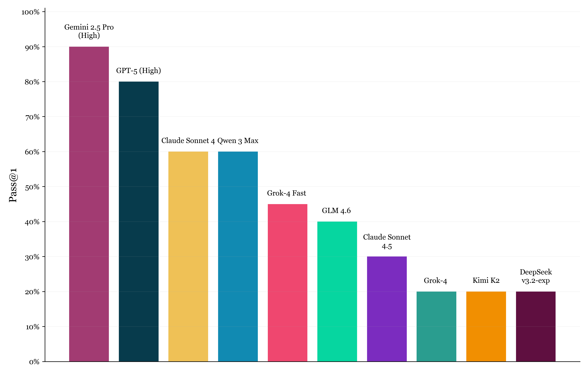
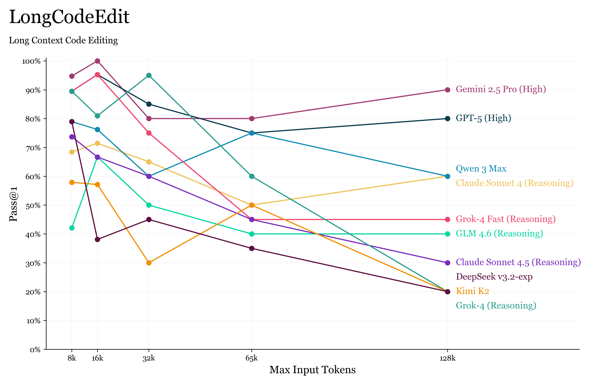
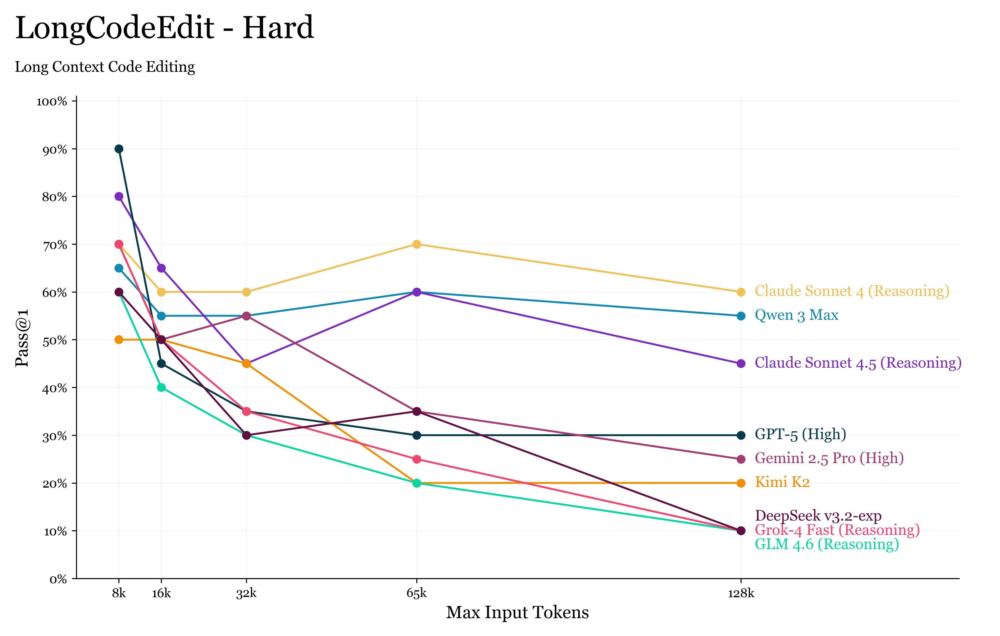

+++
title = 'Evaluating Long Context (Reasoning) Ability'
date = 2025-10-16
[params]
subtitle = "What do 1M and 500K context windows have in common? They are both actually 64K."
math = true
+++

<figure class="context-figure context-figure--image">
  
  <p class="context-figure__note">Pass@1 scores on the 128k subset of LongCodeEdit.</p>
</figure>
<br>


Reasoning models and long agent trajectories are eating up valuable space in the context window. In response, models are being released with ever-increasing context windows; the latest, Grok 4 Fast, has a 2 million token window. 

Unfortunately, as anyone who has worked with these models knows, the number of tokens a model can accept as input is not the same as the number of tokens it can reason over. Performance often degrades well before reaching the advertised context window length. This seems at odds with the perfect context window claims from the many model providers.

<div class="context-figure">
  <figcaption>Effective context length</figcaption>
  <div class="context-figure__rows">
    <div class="context-figure__row">
      <div class="context-figure__models">Gemini 2.5 Pro (High), GPT-5 (High)</div>
      <div class="context-figure__range">128k (Max)</div>
    </div>
    <div class="context-figure__row">
      <div class="context-figure__models">Claude Sonnet 4, Qwen 3 Max (blue)</div>
      <div class="context-figure__range">64k–128k</div>
    </div>
    <div class="context-figure__row">
      <div class="context-figure__models">Grok-4 Fast, DeepSeek Chat v3.1</div>
      <div class="context-figure__range">32k–64k</div>
    </div>
    <div class="context-figure__row">
      <div class="context-figure__models">Grok-4</div>
      <div class="context-figure__range">16k–32k</div>
    </div>
    <div class="context-figure__row">
      <div class="context-figure__models">Kimi K2, GLM 4.5 (High)</div>
      <div class="context-figure__range">&lt;32k</div>
    </div>
  </div>
</div>

<div class="context-figure__note">
  Effective context length is the maximum input token length where a model's performance remains high and stable on LongCodeEdit (max context length of 128k).
</div>
<br>

In this post, I will show why this discrepency exists by looking at existing long context benchmarks. I will then discuss what makes a good long context benchmark and introduce a new benchmark—LongCodeEdit.


## Existing Long Context Evaluation
Existing long context benchmarks have progressively attempted to answer three questions.

### 1. Can the model access its context window?
This is a rather straightforward question as it is simply a matter of whether the very last token can attend to the very first. For example, a model that can take as input 1M tokens but was trained on 4K sequences is unlikely to be able to access its entire context window due to the masking during training. 

The first widely used long context benchmark was [Needle In A Haystack](https://github.com/gkamradt/LLMTest_NeedleInAHaystack) (NIAH). Here, the model receives a query, a long “haystack” of text, and a hidden “needle” containing the answer and its task is to retrieve the needle. This was later adapted by [RULER](https://arxiv.org/abs/2404.06654) to include multiple needles and even distractor needles. 

<div style="margin: 0 auto; text-align: center;">
  
  <div style="margin-top: -10px; font-size: 14px">Needle In A Haystack results for GPT4. <a href="https://github.com/gkamradt/LLMTest_NeedleInAHaystack/blob/main/img/GPT_4_testing.png" target="_blank" style="text-decoration: underline;">Source</a></div>
</div>
<br>

The all-green plots from this benchmark often went viral and captured significant mindshare. However, this soon became saturated and is no longer a robust indicator of long context capabilities. To understand why, let's look at a RULER example:

<div style="display: flex; justify-content: center; margin: 20px 0;">
  <div style="width: 90%; max-width: 800px;">
    <div style="padding: 20px; background-color: white;">
      <div style="margin-bottom: 5px; font-size: 13px;">
        <span style ="color: #666; opacity: 0.7">...Which means that what matters is who you are, not when you do it. If you're the right sort of person, you'll win even in a bad economy. And if you're not, a good economy won't save you.</span> <span style="color: red;opacity: 1">The special magic number for XXX is 12345.</span> <span style ="color: #666; opacity: 0.7">Someone who thinks "I better not start a startup now, because the economy is so bad" is making the same mistake as the people who thought during the Bubble "all I have to do is start a startup, and I'll be rich."...</span>
      </div>
      <div style="font-weight: normal; font-size: 13px; margin-top: 20px; border-top: 1px solid #e0e0e0; padding-top: 20px;">
        Question: What is the special magic number for XXX?
      </div>
    </div>
  </div>
</div>
The needle is completely unrelated to the haystack and this becomes a simple retrieval task with almost no reasoning required. The model simply has to look for and repeat past occurrences of the needle.

### 2. Is the model able to understand every input token?
Under this setting, we assume that the model is able to retrieve the necessary information and we are now interested in how well it understands the context window.

The best version of this is [NoLiMa](https://arxiv.org/abs/2502.05167) which turns NIAH into a question answering task. The "needle" is a piece of information that comes from the same distribution as the haystack but with minimal literal overlap with the query, forcing at least one reasoning step to draw an association between the two.

RULER also includes a QA task using the SQuAD dataset. [HELMET](https://arxiv.org/abs/2410.02694) concatenated many documents together and asks a question from any one of the documents. [LongBench v2](https://arxiv.org/abs/2412.15204) extends question answering to even more domains including code repositories, structured data and long dialogues. The [Fiction.Live](https://fiction.live/stories/Fiction-liveBench-Feb-21-2025/oQdzQvKHw8JyXbN87) benchmark is an example of a difficult Question Answering task where the answer cannot just be extracted from a single sentence within the context and requires reasoning over the entire document. 

### 3. Is the model able to perform real-world long context tasks?
The problem with long context benchmarks is that high quality long context data is hard to come by, so most approaches resort to padding an existing language modelling task with often irrelevant input tokens. The underlying task itself is often simple - SQuAD v2 (used in RULER) was released in 2018 and is effectively saturated by all frontier LLMs. For example, if we compare the difficulty of these long context benchmarks to generic intelligence benchmarks (such as GPQA Diamond), the difference is stark.


<figure style="margin: 0 auto 2rem; max-width: 760px; display: flex; flex-direction: column; gap: 1rem;">
  <div style="display: grid; gap: 1rem; grid-template-columns: repeat(auto-fit, minmax(280px, 1fr));">
    <section class="context-figure" style="padding: 0.9rem 1rem;">
      <header style="font-weight: 600; font-size: 0.92rem; margin: 0 0 0.45rem 0; color: #b4102d;">NoLiMa</header>
      <p style="margin: 0 0 0.45rem 0; font-size: 0.9rem; line-height: 1.5; color: #383838;">&hellip; ... Actually, Yuki lives next to the Semper Opera House. &hellip; ... </p>
      <hr style="margin: 0.6rem 0 0.45rem; border: 0; border-top: 1px solid rgba(0, 0, 0, 0.12);">
      <p style="margin: 0 0 0.45rem 0; font-size: 0.9rem; line-height: 1.5; color: #3b3b3b;">Question: Which character has been to Dresden?</p>
      <p style="margin: 0; font-size: 0.9rem; line-height: 1.5; color: #3b3b3b;">Answer: Yuki (The Semper Opera House is in Dresden)</p>
    </section>
    <section class="context-figure" style="padding: 0.9rem 1rem;">
      <header style="font-weight: 600; font-size: 0.92rem; margin: 0 0 0.5rem 0; color: rgba(26, 43, 76, 0.78);">GPQA Diamond</header>
      <p style="margin: 0 0 0.65rem 0; font-size: 0.9rem; line-height: 1.55; color: #233354;">Imagine a situation where a novel natural molecule, Xantheraquin, is discovered and is being investigated for in silico testing against a bacterial pathogen that is multidrug resistant. Preliminary studies indicate that Xantheraquin has multiple chiral centers and can exist in various tautomeric forms. Which of the following steps would be the MOST crucial before proceeding with in silico docking studies, given the complexities of bioinformatics in structure-based drug discovery?</p>
      <p style="margin: 0 0 0.35rem 0; font-size: 0.9rem; line-height: 1.5; color: #233354;">A) Analyze all tautomeric and chiral forms, but prioritize those forms that are most likely to be biologically active based on physicochemical properties.</p>
      <p style="margin: 0 0 0.35rem 0; font-size: 0.9rem; line-height: 1.5; color: #233354;">B) Use the most stable chiral form of Xantheraquin, relying on quantum mechanical calculations to predict its interaction with the bacterial target.</p>
      <p style="margin: 0 0 0.35rem 0; font-size: 0.9rem; line-height: 1.5; color: #233354;">C) Focus on Xantheraquin's pharmacokinetics and ADME (Absorption, Distribution, Metabolism, Excretion) properties, using molecular dynamics simulations to predict its behavior in a biological system.</p>
      <p style="margin: 0 0 0.6rem 0; font-size: 0.9rem; line-height: 1.5; color: #233354;">D) Combine in silico predictions with preliminary in vitro binding affinity assays to validate the most promising forms of Xantheraquin before extensive docking studies.</p>
      <hr style="margin: 0.6rem 0 0.45rem; border: 0; border-top: 1px solid rgba(0, 0, 0, 0.12);">
      <p style="margin: 0; font-size: 0.9rem; line-height: 1.5; color: #233354;">Answer: D</p>
    </section>
  </div>
  <figcaption style="margin: 0; font-size: 0.82rem; line-height: 1.45; color: #5c5c5c; text-align: center;">
    New models are often evaluated on "PhD-level" problems, but the moment it comes to long context, for some reason, we have lowered our expectations to "tasks that were solved years ago by Flan-T5 but much longer".
  </figcaption>
</figure>

OpenAI recently released [MRCR](https://huggingface.co/datasets/openai/mrcr) which offers their definition of challenging long context tasks:
> OpenAI-MRCR is challenging because:
> - The needles are selected from the same distribution as the distractors. All assistant responses are generated by gpt4o, so the needle blends in with the haystack.
> - The model must distinguish order amongst the needles.
> - The more needles, the harder the task.
> - The longer the context, the harder the task.

The problem with this definition is that it still isn't fully representative of the difficulty of real-world long context tasks. Compare "Repeat the second poem about Tapirs" in MRCR to ["Find the mistake present in this financial report."](https://x.com/levie/status/1953670264988016931) or a deep research agent having to sift through a long list of search results to generate a report. The latter two clearly require much more sophisticated reasoning and understanding.

## What makes a good long context benchmark?
It is helpful to think of a long context task as consisting of two stages. First, the model must determine which parts of the input are relevant, and then it must perform the actual task. For the purposes of evaluation, we want both of these stages to be difficult and require substantial reasoning. For example, the relevant parts ("needle") should be, at a minimum, from the same distribution as the rest of the sequence and the task itself should not be something as simple as repeating a sentence. Many existing benchmarks only attempt to make the first stage difficult by simply padding the search space. 

A good example of a challenging benchmark is [GSM-Infinite](https://arxiv.org/abs/2502.05252) which evaluates models on synthetic grade school math problems with increasing lengths. Every additional piece of information adds a node to the computational graph, which makes it more difficult for the model to traverse. Another good example is [LoCoDiff](https://abanteai.github.io/LoCoDiff-bench/index.html) which provides models with diffs and asks them to output the final state of the file. In this case, there is no relevancy check as every diff is relevant. However, the task difficulty does scale with the sequence length as the model has to handle more state changes. In fact, the LoCoDiff leaderboard provides a much better definition of challenging long context tasks compared to OpenAI's which still heavily emphasizes the retrieval aspect:

> - Utilizes naturally interconnected content, not artificially generated or padded context
> - No junk context: every part of the context is required for the task
> - Tests a real skill critical for coding agents: keeping track of the state of edited files

The problem with reducing a long context task to retrieval is that it fails to account for another failure mode beyond the inability to access the context window - where models often exhibit reduced reasoning ability as context length increases, even when they can access all relevant information. This is often known as "Context Rot" and some examples of this degradation are increased likelihood of hallucination, instability, or "doom loops" in long agentic interactions. Therefore, effective benchmarks need to go beyond assessing the ability to retrieve the right span and instead also evaluate the ability to maintain reasoning quality even at long context lengths.

In the following sections, I will attempt to come up with a new long context benchmark. In doing so, I hope to show my process behind benchmark design and compare what I come up with against the criteria outlined above.


## Paraphrased Sentence Repeater (PSRBench)
<div style="margin: 0 auto; text-align: center;">
  
  <div style="margin-top: -15px; font-size: 14px">Paraphrased Sentence Repeater (PSRBench) Scores</div>
</div>
<br>

The first attempt borrows the same approach as many existing ones. PSRBench is a benchmark that provides models with a long document and a sentence that has been paraphrased. The model is then asked to return the sentence that comes before or after the original non-paraphrased sentence. Following MRCR, models are evaluated on the Longest Consecutive Subsequence ratio. The documents are taken from the [LongWriter dataset](https://huggingface.co/datasets/zai-org/LongWriter-6k) and concatenated together to form input prompts of varying context lengths. A random sentence is sampled from the document and paraphrased with Gemini 2.5.

<div style="display: flex; justify-content: center; margin: 20px 0;">
  <div style="width: 90%; max-width: 800px;">
    <div style="padding: 20px; background-color: white;">
      <div style="margin-bottom: 5px; font-size: 13px;">
        Vault Boy's mischievous grin widened as he prepared to unleash his noxious weapon upon the unsuspecting aquatic life. <span style="color: #2E86AB; opacity: 1">With deliberate slowness, he positioned himself in the center of the water, ensuring he had the deepest part of the pool. </span> <span style="color: #ff0000; opacity: 1">His feet anchored in the soft, silty bottom, feeling the slight squish of the mud as he steadied himself.</span>
      </div>
      <div style="font-weight: normal; font-size: 13px; margin-top: 20px; border-top: 1px solid #e0e0e0; padding-top: 20px;">
        Question: What sentence comes <span style="text-decoration: underline;">after</span> the sentence that has the same meaning as <span style="color: green;opacity: 1">"He methodically situated himself in the pool's center, making certain he was in its deepest section"</span>?
      </div>
    </div>
  </div>
</div>
<div style="text-align: center; font-size: 12px; margin-top: -30px; color: #666;">
  The paraphrased sentence is in green, the original sentence is in blue and the needle is in red.
</div>
<br>

PSRBench is an improvement over many NIAH benchmarks since just like NoLiMa, the needle is constructed to not be an exact match with the query. Similarly, the needle is from the same distribution as the distractors whereby it is indistinguishable without the query. However, the relevancy determination stage is pretty simple as the model has to simply semantically compare every sentence to the query. This is something LLMs are veery good at. The task itself of just repeating the output sentence is also trivial.

PSRBench thus has the same flaws as many other benchmarks - the model is required to do a relatively easy task ~O(tokens) and the challenge is simply whether the model can iteratively do this over a few thousand tokens. Other examples of such approaches are [$\infty$Bench](https://arxiv.org/abs/2402.13718) where models have to find the largest numbers from a long list; RULER also has two synthetic tasks where the model is tasked with tracking variables over a long chain of variable assignments (e.g. `x1 = 123; x2 = x1; x3 = x2`), and extracting the most common word from a long list of words; and OpenAI's [GraphWalks](https://huggingface.co/datasets/openai/graphwalks) where the model has to perform a BFS when provided with an adjacency list of a graph.

## LongCodeEdit 
In my opinion, a good approach to designing a benchmark is to think of a real-world task that requires long-context ability and then try to isolate the setting as much as possible. One example is in Software Engineering when an agent has to read through a large codebase and make edits to multiple files all within the same agent trajectory. In this section, I introduce LongCodeEdit, a benchmark that evaluates models on their ability to identify and fix bugs when provided with large amounts of code.

<div style="margin: 0 auto; text-align: center;">
  
  <div style="margin-top: -15px; font-size: 14px">LongCodeEdit Scores</div>
</div>
<br>

Using samples from [BigCodeBench](https://arxiv.org/abs/2406.15877), we manually corrupt Python functions to ensure they fail provided test cases while still being syntactically valid <a href="#footnote-1" id="footnote-ref-1">[1]</a>. Multiple functions, of which only one is corrupted, are concatenated together with their corresponding test cases. The model is then asked to identify and fix the problematic function, and is evaluated via Pass@1.

```python
# def task_func1 ...
# def task_func2 ...
def task_func_3(src_folder, backup_dir):
    """
    Backs up a given source folder to the specified backup directory, then deletes the source folder.
    
    Parameters:
    src_folder (str): The path of the source folder to be backed up and deleted.
    backup_dir (str): The path of the directory where the source folder will be backed up.
    
    Returns:
    bool: True if the operation is successful, False otherwise.
    
    Requirements:
    - os
    - shutil
    
    Raises:
    - ValueError: If the source folder does not exist.
    - Exception: If an error occurs while deleting the source folder.
    
    Example:
    >>> import tempfile
    >>> src_folder = tempfile.mkdtemp()
    >>> backup_dir = tempfile.mkdtemp()
    >>> with open(os.path.join(src_folder, 'sample.txt'), 'w') as f:
    ...     _ = f.write('This is a sample file.')
    >>> task_func_3(src_folder, backup_dir)
    True
    """
    if os.path.isdir(src_folder): # <--- This is the bug
        raise ValueError(f"Source folder '{src_folder}' does not exist.")
    backup_folder = os.path.join(backup_dir, os.path.basename(src_folder))
    shutil.copytree(src_folder, backup_folder)
    try:
        shutil.rmtree(src_folder)
        return False
    except Exception as e:
        print(f'Error while deleting source folder: {e}')
        return False
# def task_func4 ...
# ...
# Test Cases for task_func1 ...
# Test Cases for task_func2 ...
# Test Cases for task_func3 ...
# ...
```
<div style="text-align: center; font-size: 12px; margin-top: -10px; color: #666;">
  The model is provided with multiple functions and their test cases. Here, the third function is the problematic one.
</div>
<br>

We can similarly evaluate how good LongCodeEdit is using the same two step approach. For the first stage of determining which function is buggy, the model has to read through every single function provided and determine if it satisfies the requirements specified in the docstring. Since all the tests are concatenated together after all the functions, the model also has to reason about multiple parts of the input at once and not just the immediate neighborhood of each function. Bug detection is also difficult as the model has to reason about the test cases and determine if the function satisfies them.

Similarly, the task itself is also much harder. A useful intuition for evaluating the inherent difficulty of the task is to consider: if we extracted only the relevant parts into a fresh context window (thereby removing the first stage), how well would the model perform? A good proxy for this is to look at the task performance at small context lengths. For example, in the case of [OpenAI-MRCR](https://openai.com/index/introducing-gpt-5-for-developers/), multiple models score >95% accuracy at 8K context lengths. For LongCodeEdit, we find that the very best models can score around 90% accuracy at shorter context lengths and so our next step is to make the task itself even harder.

## LongCodeEdit - Hard
LongCodeEdit-Hard is a version of LongCodeEdit that does not provide the model with the test cases, replacing them with even more functions. This closely reflects the setting of many code generation benchmarks (including BigCodeBench) where the model has no information about the test cases or requirements beyond the docstring and the provided problem specification.

<div style="margin: 0 auto; text-align: center;">
  
  <div style="margin-top: -15px; font-size: 14px">LongCodeEdit - Hard Scores</div>
</div>
<br>

We notice that LongCodeEdit-Hard is significantly harder, with models scoring 60 to 70% even in the 8K context length setting. This meets our criteria for a good long context benchmark, as both the relevancy determination and reasoning stages are difficult and scale naturally with context length.

Interestingly, we notice some changes in the relative performance of models in this setting. The plot below normalizes the code editing ability of the model and simply checks if the model correctly identifies the problematic function.

<div style="margin: 0 auto; text-align: center;">
  
  <div style="margin-top: -15px; font-size: 14px">LongCodeEdit - Hard Detection Scores</div>
</div>
<br>

The results being similar to the Pass@1 scores imply that the main failure mode is a bug detection failure rather than a code editing one. One interpretation of the results is that models that perform worse on the hard version get easily distracted. Without the test cases, models have to rely purely on the docstring to understand each function's requirements and thus might overthink or hallucinate bugs in other correct functions. Given that the corruptions applied to the functions are extremely subtle (more on that soon), they serve as very strong distractors.


## Final Thoughts
The point of this post isn't to say that we don't need benchmarks that only answer Questions [1](#1-can-the-model-access-its-context-window) and [2](#2-is-the-model-able-to-understand-every-input-token). Research into better understanding the long context limits of architectures is and will always remain important. For example, [Qwen 3 Next](https://qwen.ai/blog?id=4074cca80393150c248e508aa62983f9cb7d27cd&from=research.latest-advancements-list) reporting RULER scores is great because it is important to know if the improved efficiency from Linear Attention comes at the cost of the model's ability to even see its entire context window.

Anecdotally, I am sure many of us have had experience with models behaving strangely, such as [outputting gibberish](https://research.trychroma.com/context-rot) or doom-looping when given long inputs. As an example, you might also have noticed that OpenAI MRCR and PSRBench report the mean match ratio instead of exact match. If we look at exact match scores on PSRBench instead, we see that even the very best models suffer ~6% performance degradation. For a task this straightforward, it is surprising that models are unable to simply repeat the sentence after they have found it and serves as further proof that both these questions are far from solved.

<div style="margin: 0 auto; text-align: center;">
  
  <div style="margin-top: -15px; font-size: 14px">PSRBench Exact Match Scores</div>
</div>
<br>

With that said, I hope this post has convinced you that existing long context benchmarks are increasingly one-dimensional and we need to find more challenging ways to evaluate a model's long context reasoning ability. This is becoming even more important with the recent discourse around [METR's long horizon evaluation](https://metr.org/blog/2025-03-19-measuring-ai-ability-to-complete-long-tasks/). Models are starting to perform real-world tasks that take humans hours to complete, and there is a huge discrepancy in difficulty between such tasks and those evaluated on existing long context benchmarks.

As a final note, the purpose of benchmarks is to expose model failure modes in settings as close to real-world as possible. When a new benchmark is released with a new model scoring near-perfect scores, the benchmark becomes more of a public relations exercise. Benchmarks are only useful when they are embarrassing and the moment we stop wincing at the results is the moment we should replace them.

### Code
Both [PSRBench](https://app.primeintellect.ai/dashboard/environments/nrehiew/paraphrased-sentence-repeater) and [LongCodeEdit](https://app.primeintellect.ai/dashboard/environments/nrehiew/long-code-edit) have been uploaded to the Prime Intellect Environments Hub. The evaluations were done with 20 samples per token length bin with a maximum context length of 128K input tokens. If you have the necessary compute, you could run RL on these environments too.

Please reach out if you have any questions or suggestions! 

_Thanks [Prime Intellect](https://primeintellect.ai/) for sponsoring the API costs for this project!_

<style>
  small[id^="footnote"] code {
    font-size: 0.75em !important;
    padding: 0 0.15em !important;
    border-radius: 0.18rem !important;
  }
</style>
<small id="footnote-1">[1] Corruptions are done at the AST level to ensure syntactically valid code. They are also designed to be quite subtle and 2 corruptions are applied to each function. Example corruptions include changing comparison operators (e.g., `<` to `<=`), introducing off-by-one errors in `range()` calls, modifying accumulator initial values (`0` to `1` or `[]` to `[0]`), swapping arithmetic operators (`+` to `-`, `*` to `//`), adjusting list indexing boundaries, and replacing function calls with similar variants (`mean` to `median`, `max` to `min`).</small>