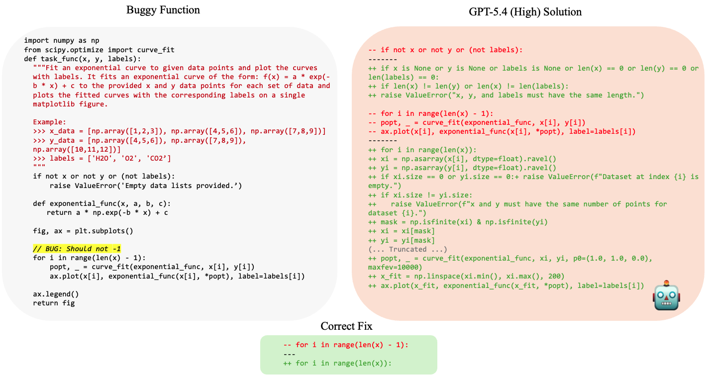
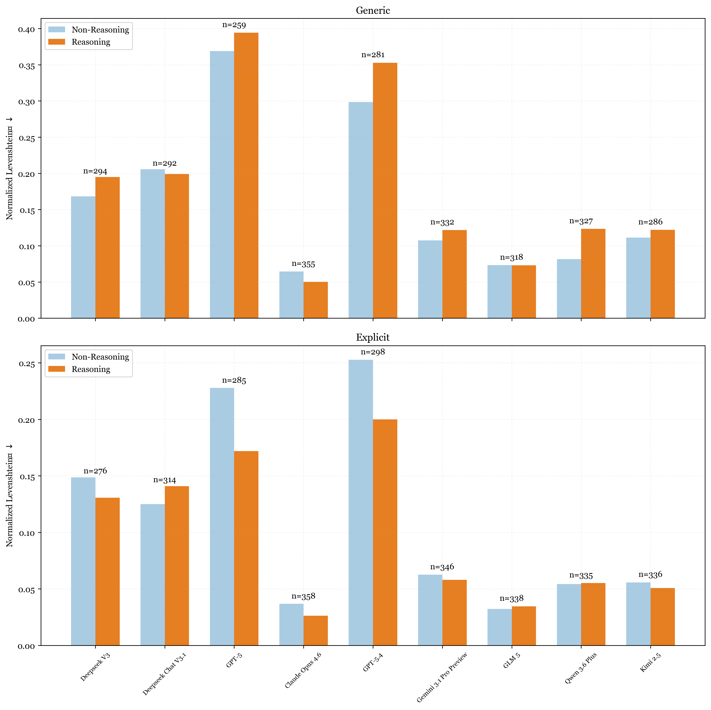

+++
title = 'Coding Models Are Doing Too Much'
date = 2026-04-15
[params]
subtitle = "Don't rewrite what isn't broken"
math = true
+++

<p><small>Code for this post is available <a href="https://github.com/nreHieW/fyp">here</a>.</small></p>

AI-assisted coding has become the norm and with tools like Cursor, GitHub Copilot, Claude Code, Codex, we are increasingly letting models touch our code. If you have used any of these tools in the past year, you have probably experienced something like this: you ask the model to fix a simple bug (perhaps a single off-by-one error, or maybe a wrong operator). The model fixes the bug but half the function has been rewritten. An extra helper function has appeared. A perfectly reasonable variable name has been renamed. New input validation has been added. And the diff is enormous.

I refer to this as the **Over-Editing** problem where models have the tendency to rewrite code that didn't need rewriting. This matters more than it might seem. Code review is already a bottleneck and reviewers need to understand what changed, why it changed, and whether the change is safe. A model that rewrites entire functions, even correctly, makes this job dramatically harder as the code is now completely unrecognizable.

In this post, I will investigate this problem: whether existing LLMs have a tendency to over-edit and whether we can train models to be more faithful editors.

## Over-Editing

<figure class="post-figure post-figure--wide">
  <a class="post-figure__link" href="images/overediting.png">
    
  </a>
  <figcaption>Figure 1: A classic example of the Over-editing problem. GPT-5.4 (High) rewrites the entire function when the correct fix is simply changing <code>range(len(x) - 1)</code> to <code>range(len(x))</code>.</figcaption>
</figure>

Over-editing refers to a model modifying code beyond what is strictly necessary to fix the problem at hand. To be precise: a model is over-editing if its output is functionally correct but structurally diverges from the original code more than the minimal fix requires. 

The example in Figure 1 illustrates this well. The bug is a single off-by-one error in a `range()` call — `range(len(x) - 1)` should be `range(len(x))`. The correct fix is a single line. GPT-5.4 (with high reasoning effort) responds by rewriting the entire function: it adds explicit `None` checks, introduces `np.asarray` conversions with `dtype=float`, adds finite-value masking, validates array sizes, changes the `curve_fit` call signature, and replaces the plotting logic entirely. While the output passes the tests and is functionally correct, the diff is enormous, and none of those additions were asked for or even necessary.

It helps to think about this in terms of the kind of work being done. Software engineering broadly splits into two modes: green-field (building something new from scratch) and brown-field (working within an existing codebase). Specifically in brown-field, the existing code has been understood by the team and has been deliberately written the way it was. The model's job is to fix the issue and nothing else. 

A common piece of advice for working with AI coding tools is to simply write more tests because if the tests pass, the code is fine. However, Over-editing is a brown-field failure where unlike correctness failures, it is invisible to test suites. As models generate more code, engineers have more to review and over-editing makes that harder. There is more complex logic to parse, more lines of code to read, and a higher chance that overall codebase quality quietly degrades.


## Measuring Over-Editing
To study over-editing, we first need a dataset of code edits where the "ground truth" edit is well-defined with some degree of "minimality". Rather than using another LLM to introduce bugs (which is what most existing benchmarks do), we programmatically corrupt 400 problems from [BigCodeBench](https://arxiv.org/abs/2406.15877) which gives us more fine-grained control — things like flipping a comparison operator (`<` → `<=`), swapping `+` for `-`, or changing boolean values (`True` → `False`).[^corruptions] Each corrupted sample remains syntactically valid and verified to break the corresponding test cases. This ensures that the ground truth edit is exactly the reversal of the corruption and nothing more, thus making this edit minimal by construction. We can then evaluate not just whether a model fixes the bug, but *how much else it changed* in the process.

### Metrics 
Most coding benchmarks evaluate models on correctness using some variant of Pass@1. However, Pass@1 is necessary but not sufficient. A model can score perfectly on Pass@1 while completely rewriting every function it touches. For this experiment, we need metrics that capture *how much* the model changed beyond what was required.
 
**Token-level Levenshtein Distance.** Unlike standard Levenshtein which counts the minimum number of character insertions, deletions, and substitutions to transform one string into another, we use a Python token-level variant. The code is first passed through Python's tokenizer, which splits it into its atomic syntactic units (`def`, `add`, `(`, `a`, `,`, `b`, `)`, `:`, `return`, `a`, `+`, `b`). Levenshtein is then computed over this token sequence rather than raw characters. 

For example, consider the following two functions:
```python
def add(a, b):                    def someotherfunctionname(a, b):
    return a + b                      return a + b
```
 
Character-level Levenshtein gives a distance of 19. Token-level Levenshtein gives a distance of 1 since `someotherfunctionname` becomes a single token. We normalize by total token count so scores are comparable across functions of different lengths. 

In addition, rather than simply comparing the model's output to the ground truth, we compare both against the corrupted input. Let $C$ be the corrupted solution, $G$ the ground truth, and $M$ the model's output. The true minimal edit (simply the reversal of the corruption) is $D_{\text{true}} = d(G, C)$ and the model's edit is $D_{\text{model}} = d(M, C)$, giving a relative patch score:
 
$$S(M) = D_{\text{model}} - D_{\text{true}}$$
 
Values closer to zero indicate the model's patch resembles the true minimal fix. The intuition is that we can interpret the original uncorrupted solution as the best possible edit to the corrupted solution, compute the scores for this best possible patch, and then compare with the model's output.
 
 
**Added Cognitive Complexity.** Cognitive Complexity (an improvement over [Cyclomatic Complexity](https://en.wikipedia.org/wiki/Cyclomatic_complexity)) measures how hard code is to understand. It penalizes nesting, recursion, mixed logical operators, and non-obvious control flow. For example a straight line of code with no branches is much easier to read than something that requires a reader to hold state, such as an `if`, a loop, or  `try/except`. An example is shown below:

```python
def process(items):
    result = []
    for item in items:          # +1
        if item > 0:            # +2 (nesting penalty: inside a loop)
            if item % 2 == 0:   # +3 (nesting penalty: two levels deep)
                result.append(item)
    return result
# Cognitive Complexity: 6
```
 
Since all our corruptions change values rather than structure, the correct fix should always add zero Cognitive Complexity. Any increase in the model's output was introduced unprompted and is unnecessary. We report the absolute difference between the model's output and the original, which should be zero for a faithful minimal edit. Values below 0 are also unwanted as unnecessary simplifications to code are also undesirable. 

## Do Models Over-Edit?
Yes, even frontier ones.

<figure class="post-table">
  <div class="post-table__wrap">
    <table>
      <thead>
        <tr>
          <th>Model</th>
          <th>Pass@1 ↑</th>
          <th>Normalized Levenshtein ↓</th>
          <th>Added Cognitive Complexity ↓</th>
        </tr>
      </thead>
      <tbody>
        <tr class="post-table__section">
          <th colspan="4">Reasoning Models</th>
        </tr>
        <tr><td>GPT-5.4</td><td>0.723</td><td>0.395</td><td>2.313</td></tr>
        <tr><td>Claude Opus 4.6</td><td><strong>0.912</strong></td><td><strong>0.060</strong></td><td>0.200</td></tr>
        <tr><td>Gemini 3.1 Pro Preview</td><td>0.858</td><td>0.145</td><td>0.501</td></tr>
        <tr><td>GLM 5 High</td><td>0.859</td><td>0.099</td><td>0.320</td></tr>
        <tr><td>Qwen 3.6 Plus</td><td>0.858</td><td>0.145</td><td><strong>0.048</strong></td></tr>
        <tr><td>Kimi 2.5</td><td>0.835</td><td>0.151</td><td>0.770</td></tr>
        <tr><td>DeepSeek R1</td><td>0.820</td><td>0.232</td><td>0.673</td></tr>
        <tr><td>DeepSeek Chat V3.1</td><td>0.795</td><td>0.232</td><td>0.694</td></tr>
        <tr><td>GPT-5 High</td><td>0.713</td><td>0.438</td><td>3.832</td></tr>
      </tbody>
      <tbody>
        <tr class="post-table__section">
          <th colspan="4">Non-Reasoning Models</th>
        </tr>
        <tr><td>GPT-5.4</td><td>0.770</td><td>0.327</td><td>1.563</td></tr>
        <tr><td>Claude Opus 4.6</td><td>0.900</td><td><strong>0.079</strong></td><td>0.313</td></tr>
        <tr><td>Gemini 3.1 Pro Preview</td><td>0.860</td><td>0.129</td><td>0.358</td></tr>
        <tr><td>GLM 5</td><td>0.840</td><td>0.097</td><td><strong>0.235</strong></td></tr>
        <tr><td>Qwen 3.6 Plus</td><td><strong>0.870</strong></td><td>0.106</td><td>0.605</td></tr>
        <tr><td>Kimi 2.5</td><td>0.770</td><td>0.140</td><td>0.687</td></tr>
        <tr><td>DeepSeek V3</td><td>0.800</td><td>0.201</td><td>0.803</td></tr>
        <tr><td>DeepSeek Chat V3.1</td><td>0.802</td><td>0.235</td><td>1.223</td></tr>
        <tr><td>GPT-5 Minimal</td><td>0.738</td><td>0.397</td><td>2.877</td></tr>
      </tbody>
    </table>
  </div>
  <figcaption>Table 1: Performance comparison of reasoning and non-reasoning models. Models that appear in both are hybrid models. Best scores for each metric are bolded.</figcaption>
</figure>

Among the latest frontier models, GPT-5.4 over-edits the most. It has a Levenshtein of 0.39 in reasoning mode and 0.33 in non-reasoning, with Added Cognitive Complexity of 2.31 and 1.56 respectively. Despite this, its Pass@1 is only 0.723 and 0.770, making it one of the weakest correctness performers too. Claude Opus 4.6 achieves the highest Pass@1 of any model evaluated (0.912 reasoning, 0.900 non-reasoning) while also producing the smallest diffs — Levenshtein of 0.06 and 0.08, Added Cognitive Complexity of 0.20 and 0.31. Gemini 3.1 Pro Preview sits in similar territory, with GLM 5 arguably the most conservative model among the open weight ones.

## Does Prompting Help?
Many papers that claim to uncover a new LLM failure mode do not first test whether the model can do the task when asked directly. A behavior that looks impossible in one setup may be easy under an explicit prompt, so I investigate the impact of adding *"IMPORTANT: Try to preserve the original code and the logic of the original code as much as possible"* to the prompt.

<figure class="post-figure post-figure--wide">
  <a class="post-figure__link" href="images/reasoning_vs_non.png">
    
  </a>
  <figcaption>Figure 2: Change in Pass@1 and Levenshtein Distance when models are prompted explicitly to keep edits minimal. Models are colour coded by reasoning mode.</figcaption>
</figure>

With explicit prompting, every model improves and reduces its Levenshtein Distance, and with the exception of DeepSeek R1/v3, also improves its Pass@1. One interpretation is that the constraint to make minimal edits inadvertently narrows the search space of possible fixes, steering models toward the kind of precise, targeted change that is more likely to be correct. The effect on Levenshtein Distance is much more pronounced in reasoning models, which is likely the result of their stronger instruction following ability.

## Does Reasoning Mean Overthinking and Over-Editing?
Reasoning models are generally assumed to be better at coding tasks, and they do score higher on Pass@1. But since we are interested in the style of these edits, we need to look at the results through a different lens.

<figure class="post-figure post-figure--wide">
  <a class="post-figure__link" href="images/comparison_plots.png">
    
  </a>
  <figcaption>Figure 3: Comparison of the Levenshtein Distance of reasoning and non-reasoning models. Models are grouped into pairs of one reasoning and non-reasoning. Lower bars are better. Labels above each pair indicate the number of problems where both models get the answer correct.</figcaption>
</figure>


Figure 3 groups the models into pairs where each pair contains a reasoning and non-reasoning model from the same family. For each pair, we plot the Levenshtein Distance of only the samples where both models get the answer correct. This allows us to isolate edit minimality from correctness since a model that fails more often has fewer samples to over-edit on, which would otherwise bias the comparison. 

In the generic setting (top), reasoning models over-edit more than their non-reasoning counterparts in the majority of pairs. DeepSeek V3, GPT-5, GPT-5.4, Gemini 3.1 Pro Preview, Qwen 3.6 Plus, and Kimi 2.5 all show the reasoning bar sitting higher. Reasoning models seems to naturally have more elaborate rewrites where the model reasons its way into a "better" implementation rather than a minimal fix. The notable exception is Claude Opus 4.6, where the reasoning variant edits substantially less than its non-reasoning counterpart.

In the explicit setting (bottom), the picture changes considerably. Once models are told to preserve the original code, reasoning models have much lower Levenshtein Distance than their non-reasoning counterparts and match or undercut them in almost every pair. Claude Opus 4.6 (reasoning) drops to the lowest Levenshtein of any model in this setting. GPT-5 and GPT-5.4 both see their reasoning variants fall significantly, though GPT-5.4's non-reasoning model still edges ahead.

Therefore, the takeaway is that the default behavior of most reasoning models is to over-edit. Left unconstrained, the extended reasoning gives models more room to "improve" code that doesn't need improving. But, that same reasoning capacity also makes them better at following the constraint once it is given. The gap between the generic and explicit setting is consistently larger for reasoning models, which suggests the over-editing is not a fundamental limitation but rather a default behavior that can be overridden.


## Training
A natural next question: can we train models to be more faithful editors? For this experiment, I start with [Qwen3 4B 2507 Instruct](https://huggingface.co/Qwen/Qwen3-4B-Instruct-2507) as the base model. I use both 0-shot and 8-shot prompting together with the explicit instruction to preserve the original code as baselines. All other methods are prompted in the generic setting without the explicit instruction during evaluation.

### Setup
I first create a synthetic dataset of corrupted problems from [DeepCoder](https://www.together.ai/blog/deepcoder) using the same approach detailed above. In addition to this programmatically generated dataset, I also use the base Qwen3 4B 2507 Instruct model to create a synthetic dataset via self-distillation. Concretely, I prompt the model to generate 8 completions per problem, keeping only the samples that are functionally correct and ranking them by Levenshtein Distance. The model is then trained without the explicit instruction similar to [Context Distillation](https://arxiv.org/abs/2209.15189).

We evaluate 4 different methods:
- **SFT**: Supervised fine-tuning directly on the programmatically generated dataset.
- **rSFT**: Rejection-sampled SFT — train on the completions with the 3 lowest Levenshtein Distances for each sample from the self-distillation dataset.
- **DPO**: Preference optimization between the completions with the highest and lowest Levenshtein Distances for each sample from the self-distillation dataset.
- **RL**: Reinforcement learning with a reward combining functional correctness and Levenshtein-based edit minimality. The reward structure is a weighted sum of the Levenshtein Distance and a penalty for failing to pass the test cases:
 
```python
r = r_edit + 0.1   # if generation passes all test cases
r = -0.2           # otherwise
 
# r_edit is normalized Levenshtein-based reward
```
 
### Does It Work?

<figure class="post-table">
  <div class="post-table__wrap">
    <table>
      <thead>
        <tr>
          <th>Model</th>
          <th>Pass@1 ↑</th>
          <th>Norm. Levenshtein ↓</th>
          <th>Added CC ↓</th>
        </tr>
      </thead>
      <tbody>
        <tr><td>Baseline (0-shot)</td><td>0.735</td><td>0.169</td><td>0.731</td></tr>
        <tr><td>Baseline (8-shot)</td><td>0.775</td><td>0.115</td><td>0.479</td></tr>
        <tr><td>SFT</td><td><strong>0.932</strong></td><td><strong>0.002</strong></td><td><strong>0.000</strong></td></tr>
        <tr><td>rSFT</td><td>0.782</td><td>0.100</td><td>0.435</td></tr>
        <tr><td>DPO</td><td>0.752</td><td>0.021</td><td>0.113</td></tr>
        <tr><td>RL</td><td>0.802</td><td>0.046</td><td>0.112</td></tr>
      </tbody>
    </table>
  </div>
    <figcaption>Table 2: Performance comparison of various fine-tuning methods when trained on in-domain data: the training and test set have the same corruption types.</figcaption>
</figure>
 
On the first attempt, SFT is almost suspiciously good as the resultant model seems to have perfectly learned the task. I found this extremely surprising and had the initial hypothesis that the model was just memorizing the reversal for this set of corruptions rather than learning a general minimal editing behavior. As a result, I re-created both synthetic datasets but instead using a completely different set of corruptions than the evaluation set to test for generalization. The core hypothesis was that the model was simply learning to reverse a particular set of corruptions.


### Does It Generalize?

<figure class="post-table">
  <div class="post-table__wrap">
    <table>
      <thead>
        <tr>
          <th>Model</th>
          <th>Pass@1 ↑</th>
          <th>Norm. Levenshtein ↓</th>
          <th>Added CC ↓</th>
          <th>LiveCodeBench Change ↓</th>
        </tr>
      </thead>
      <tbody>
        <tr><td>Baseline (0-shot)</td><td>0.735</td><td>0.169</td><td>0.731</td><td>—</td></tr>
        <tr><td>Baseline (8-shot)</td><td>0.775</td><td>0.115</td><td>0.479</td><td>—</td></tr>
        <tr><td>SFT</td><td>0.458</td><td>−0.008</td><td>0.006</td><td>−0.149</td></tr>
        <tr><td>rSFT</td><td>0.780</td><td>0.107</td><td>0.501</td><td>−0.069</td></tr>
        <tr><td>DPO</td><td><strong>0.787</strong></td><td>0.092</td><td>0.348</td><td>−0.046</td></tr>
        <tr><td><strong>RL</strong></td><td>0.782</td><td><strong>0.050</strong></td><td><strong>0.185</strong></td><td><strong>+0.006</strong></td></tr>
      </tbody>
    </table>
  </div>
      <figcaption>Table 3: Performance comparison of various fine-tuning methods when trained on out-of-domain data: the training and test set have different corruption types.</figcaption>
</figure>
 
SFT collapses entirely out-of-domain. Pass@1 drops to 0.458 as the model has learned to make specific minimal changes regardless of whether they fix anything. rSFT and DPO are both better but the overall improvement is slight compared to the 8-shot baseline. This indicates that training on traces distilled from the base model itself is sufficient to induce some degree of generalization. RL is the only method that generalizes cleanly, improving on all three metrics over both baselines. The fact that the RL model has larger improvements on Levenshtein Distance and Added Cognitive Complexity than on Pass@1 is further evidence that it is not just memorizing corruption reversals but has actually generalized to minimal editing.

Given the SFT model’s inability to even fix bugs, we also wanted to look at Catastrophic Forgetting — specifically, whether fine-tuning for minimal editing degrades general coding ability. We evaluate all fine-tuned models on LiveCodeBench v6 and compare against the original pretrained model. Ideally, performance should remain similar after training.

SFT shows a 43% performance degradation, which aligns with our earlier finding that it can no longer identify and fix basic bugs. The rSFT and DPO models experience slight degradation, indicating that even though they were trained on samples generated by the original model, the nature of the task still results in some degree of Catastrophic Forgetting. The RL model, however, does not experience any degradation. Combined with the fact that it also performs the task best, RL is able to teach the model a new behavior without degrading previously acquired abilities. This aligns with broader work showing that [SFT memorizes while RL generalizes](https://arxiv.org/abs/2501.17161).

Inspired by other work showing that [RL's has a bias towards KL-minimal solutions reduces forgetting](https://arxiv.org/abs/2509.04259), we can interpret these results from a distributional perspective. Specifically, the distribution of the programmatically generated dataset is very different from the model's original distribution. As a result, the SFT model's distribution has been heavily modified and thus suffers from Catastrophic Forgetting. In contrast, for both rSFT and DPO, the distribution of the self-distilled dataset is more aligned and is thus less heavy-handed in nature when shaping the trained model's distribution. Therefore, it is likely that the degree of Catastrophic Forgetting is proportional to the difference between the model's original distribution and the distribution of the task training data.


### Additional Experiments
#### RL with LoRA: Do We Need Full Fine-Tuning?
Given that this task is less about teaching the model new knowledge and more about tuning its style on an existing task, we also wanted to explore whether LoRA would be sufficient. Since the base model already has the capability to edit code and fix bugs, full fine-tuning might not be necessary.
 
<figure class="post-table">
  <div class="post-table__wrap">
    <table>
      <thead>
        <tr>
          <th>Rank</th>
          <th>Pass@1 ↑</th>
          <th>Norm. Levenshtein ↓</th>
          <th>Added CC ↓</th>
          <th>LiveCodeBench Δ ↑</th>
        </tr>
      </thead>
      <tbody>
        <tr><td>1</td><td>0.738</td><td>0.166</td><td>0.676</td><td>-0.022</td></tr>
        <tr><td>8</td><td>0.775</td><td>0.112</td><td>0.426</td><td>-0.022</td></tr>
        <tr><td>16</td><td><strong>0.805</strong></td><td>0.087</td><td>0.328</td><td>-0.005</td></tr>
        <tr><td>32</td><td>0.795</td><td>0.065</td><td>0.235</td><td>-0.011</td></tr>
        <tr><td>64</td><td>0.797</td><td>0.051</td><td><strong>0.160</strong></td><td>+0.001</td></tr>
        <tr><td>Full RL (best)</td><td>0.782</td><td><strong>0.050</strong></td><td>0.185</td><td><strong>+0.006</strong></td></tr>
      </tbody>
    </table>
  </div>
      <figcaption>Table 4: Performance comparison of various LoRA ranks.</figcaption>
</figure>

The results support the hypothesis. LoRA at rank 64 nearly matches full RL on Levenshtein Distance and beats it on Added Cognitive Complexity. LiveCodeBench dips slightly at low ranks but rank 64 is effectively flat, and full RL remains best overall. There is a clean monotonic trend as rank increases — both Levenshtein and Added CC fall steadily from rank 1 to rank 64. The rate of improvement is not uniform though, as the biggest gains happen early. Rank 1 to 16 accounts for most of the Levenshtein reduction (0.166 → 0.087), while rank 16 to 64 closes the remaining gap more gradually (0.087 → 0.051). Ranks 1 and 8 also trade correctness for edit minimality which could be explained by a lack of sufficient capacity to learn both reward functions and instead bias towards the higher-reward edit minimality.

This is consistent with the idea that a small number of additional parameters is enough to shift the model's editing behavior and more capacity beyond a certain point yields diminishing returns. For style-level behavioral changes where the underlying capability is already present, LoRA is likely sufficient and considerably cheaper to run.

<section class="context-figure" style="padding: 0.95rem 1.1rem;">
  <header style="font-weight: 600; font-size: 0.92rem; margin: 0 0 0.45rem 0; color: #b4102d;">A Note on Reward Hacking</header>
  <p style="margin: 0; font-size: 0.95rem; line-height: 1.65; color: #383838;">The original version of the reward function had a bug where rollouts with no successful execution were given a hardcoded reward of 0. This ended up being a higher reward than rollouts with successful execution since the Levenshtein distance was negated to make it "higher is better." I found it interesting that even with this buggy reward function, full RL was still able to learn the task. Only with LoRA did the model fail to learn it, seemingly reward hacking by learning to never output functionally correct code which triggered an investigation into the environment. With the fixed reward function, the results of full RL improved only slightly.</p>
</section>


#### Does It Scale?
Lastly, to validate the results across larger models, I apply the same RL recipe using the Out-of-Domain data onto the larger [Qwen3 14B](https://huggingface.co/Qwen/Qwen3-14B) model. Even at larger parameter counts, there are performance gains across the board with higher Pass@1, lower Levenshtein Distance, lower Added Cognitive Complexity, and no indication of Catastrophic Forgetting. This gives me the confidence that such a recipe for the task of Minimal Code Editing can be extended to various models of different scales.


<figure class="post-table">
  <div class="post-table__wrap">
    <table>
      <thead>
        <tr>
          <th>Model</th>
          <th>Pass@1 ↑</th>
          <th>Norm. Levenshtein ↓</th>
          <th>Added CC ↓</th>
          <th>LiveCodeBench Δ ↑</th>
        </tr>
      </thead>
      <tbody>
        <tr><td>Baseline: 14B</td><td>0.770</td><td>0.136</td><td>0.315</td><td>-</td></tr>
        <tr><td><strong>RL</strong></td><td><strong>0.833</strong></td><td><strong>0.059</strong></td><td><strong>0.165</strong></td><td><strong>+0.011</strong></td></tr>
      </tbody>
    </table>
  </div>
      <figcaption>Table 5: Performance comparison of RL when trained on Qwen3 14B.</figcaption>
</figure>


## Final Thoughts
<section class="context-figure" style="padding: 0.95rem 1.1rem;">
  <header style="font-weight: 600; font-size: 0.92rem; margin: 0 0 0.45rem 0; color: #b4102d;">A Note on GPT 5.4 and Opus 4.6</header>
  <p style="margin: 0; font-size: 0.95rem; line-height: 1.65; color: #383838;">
  It is notable that, despite being a frontier model, GPT 5.4 struggles on the minimal editing task, especially in the generic setting and relative to Opus 4.6. Figure 3, however, shows that it sees one of the largest gains when explicitly prompted in reasoning mode, second only to its predecessor GPT 5, which suggests strong instruction following capabilities. By contrast, Opus 4.6 shows one of the smallest improvements, though that may simply reflect its already strong baseline performance. This pattern fits the broader view that while GPT 5.4 often defaults to overly verbose code ("slop"), its behavior can be steered effectively with proper prompting.
  </p>
</section>

Taken together, the results suggest that Over-Editing is both widespread and measurable. At the same time, the prompting results show that this is not purely a capability limitation. Especially for reasoning models, a simple instruction to preserve the original code leads to much more faithful edits, which is an encouraging sign that when models like GPT 5.4 over-edit, they can still be steered toward higher-quality code. 

Further, the training results suggest that this behavior can be improved. Reinforcement learning produced more faithful editors without degradation in general coding ability, and those gains held up across both the 4B and 14B Qwen3 models.

Admittedly, the field of code benchmarks has gone on from simple single function evaluations to more agentic evaluation paradigms like [SWE-Bench Pro](https://arxiv.org/abs/2509.16941). Relative to those, evaluating bug fixes in isolated functions is still a fairly contained task given the nature of the bugs. 

Even so, in my experience, despite the prevalence of Over-Editing across all frontier coding models today, it has long been difficult to quantify in realistic settings. I hope this work can serve as a first step toward evaluating and improving the minimal editing capability of coding models, and ultimately the overall quality of AI-generated code.

<br>
<p><small><strong>Acknowledgements</strong>: <br>I am grateful to my supervisor A/P Min-Yen Kan and my advisor Tongyao Zhu for their guidance, and to Prime Intellect for sponsoring the compute and API costs of this project.</small></p>


[^corruptions]: The full list of corruptions can be found in the [code](https://github.com/nreHieW/fyp/blob/main/partial_edits/utils/code_corruptor.py).