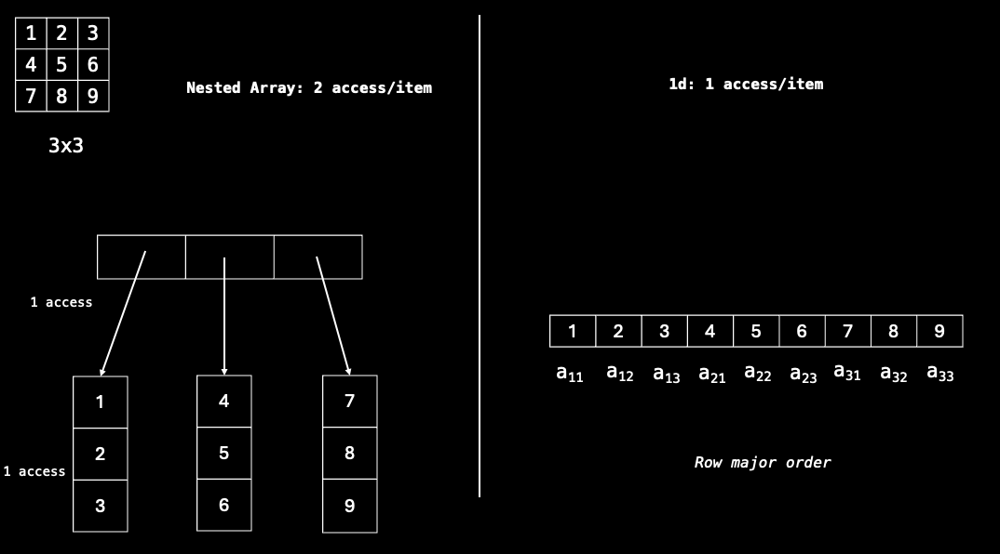
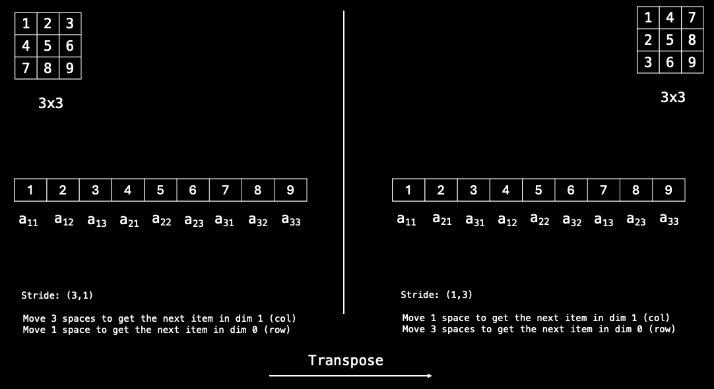

+++
title = 'Taking PyTorch for Granted'
date = 2024-07-04T09:51:47+08:00
[params]
subtitle = "Understanding PyTorch without the abstractions"
toc=false
+++

# Taking PyTorch For Granted 
###  *Lessons from implementing PyTorch without the abstractions of Python*

A while back I challenged myself to implement [micrograd](https://github.com/karpathy/micrograd) in Rust using only the standard library. Along the way, I thought that it would be a fun to attempt to implement a fully functioning Tensor library on top of micrograd. I thought that my familarity with PyTorch will make this easier but having to do so without the higher-level abstractions of Python turned out much harder than expected. 

In this post, I hope to share some of my learnings throughout this process which forced me to think deeply about how PyTorch actually works under the hood. You might be wondering why understanding the mechanics of PyTorch is important in the first place. I claim that not understanding these abstractions or simply taking them at face value can introduce a whole host of bugs to your code, at best it might be poorly optimised and at worst your computational graph is broken and your model can never learn. 

*I'll assume that you have some basic familiarity with Backpropagation, PyTorch and how computers work. If that's not the case, I will still add as many references as I can so that you can still build an intuition surrounding these concepts.*

## But what is a tensor?
In the context of Machine Learning, a tensor is a $n$-dimensional matrix. Okay, but what is a `torch.Tensor`? Specifically, what actually happens when the following piece of code is run: `a = torch.tensor(1.0, requires_grad=True)`.  It turns out that PyTorch will allocate the data on the heap and returns the pointer to that data as a shared pointer <sup>[1](https://discuss.pytorch.org/t/where-does-torch-tensor-create-the-object-stack-or-heap/182753)</sup>.  To better understand pointers in PyTorch, let's look at a few examples.
```python 
a = torch.arange(9).reshape(3, 3) # 3x3
b = a.t() # Transpose
b[0, 0] = 9999
a
# >> tensor([[9999, 1, 2], [3, 4, 5], [6, 7, 8]])
```

In the example above, notice that `.t()` returns a pointer which means that both `a` and `b` are pointing to the same underlying data and any modification to that underlying data can be seen from both pointers. 

```python 
a = torch.arange(9).reshape(3, 3) # torch.int64
b = a.to(torch.float16)
b[0][0] = 1000
print(a[0][0].item(), b[0][0].item()) # 0 1000.0
```

However, in this second example `b` is also a pointer but a pointer to a completely different Tensor with a completely different piece of data. The reason is because PyTorch has to represent a `float16` completely different from how `int64` is represented in memory. Therefore, PyTorch has to make a copy of the data and represent it in a different way.

Now, let's try to unpack at a high level what the underlying data actually is. According to PyTorch, a tensor contains a data structure known as `torch.Storage` which 'stores all the data that the `torch.Tensor` views' <sup>[2](https://pytorch.org/docs/stable/storage.html)</sup>. We also know that a Tensor has to contain other information like its gradient, the backward function etc <sup>[3](https://www.youtube.com/watch?v=VMj-3S1tku0&pp=ygUJbWljcm9ncmFk)</sup>. Then, we now have a skeleton of what a `torch.Tensor` might look like.

This forms our first intuition of the underlying data structure of a `torch.Tensor`.
```rust
struct Tensor {
	data: torch.Storage.
	grad: Tensor,
	grad_fn: BackwardFn
	.... // other metadata
}
```

## Implementing Storage 
Let's now take a look at how `torch.Storage` is implemented by first considering a simple $2$-dimensional matrix as an example. The most straightforward approach is to simply define a nested array `m = [[1,2],[3,4]]`. While this representation reflects the data quite accurately and visually, there are 2 main problems:

1. Working with arrays that can be of any arbitrary depth in terms of nesting is troublesome especially in statically typed languages.
2. More importantly, we incur a significant performance overhead.

Suppose we want to access the element 2 at position $(1, 2)$, we will need to index into the array with `m[0][1]`. Notice that `m` is a list of lists which means that to access any element, we need 2 accesses. More generally, a nested array scheme for any $n$-dimensional array incurs $n$ memory accesses for a single item which is not ideal.

Can we do better and have only 1 memory access per item? The key observation is that the $(x,y)$ coordinate scheme is only useful for us to visualise the layout of the matrix, but this is not necessary for the computer. In fact, according to the `torch.Storage` documentation, `torch.Storage` is a "a contiguous, 1-dimensional array of elements". Then it follows that as long as we can define some function <sup>[4](https://github.com/nreHieW/r-nn/blob/main/src/core/tensor/mod.rs#L92)</sup> that maps our $(x,y)$ coordinate scheme (or indeed any $n$-dimensional scheme) to this 1 dimensional representation, we would have successfully achieved a implementation with only a single memory access per item. 


This representation has several benefits. From a practical standpoint, other than the single memory access required, elements are guaranteed to be adjacent to each other in memory which allows us to make better use of spatial locality <sup>[5](https://en.wikipedia.org/wiki/Locality_of_reference)</sup> in our cache. 

From an implementation perspective, this makes it extremely easy to understand how operations like `.reshape()` and `.view()` works. The underlying storage does not change, we simply need to adapt our mapping function from the coordinate system of the old shape to that of the new shape. If the mapping function [already takes in the shape as an input](https://github.com/nreHieW/r-nn/blob/main/src/core/tensor/mod.rs#L92), all that needs to be done is to [simply change the shape attribute](https://github.com/nreHieW/r-nn/blob/main/src/core/tensor/mod.rs#L172). 

In `r-nn`, I created a function to explicitly map the index to the 1-dimensional representation each time an indexing operation occurs for clarity purposes. You might however think that computing this mapping each time we want to access an element creates unnecessary overhead, and you would be right! PyTorch maintains this mapping using a `stride` attribute which is updated each time the shape of the Tensor changes. 



The above example illustrates how stride allows for efficient indexing into the data. The $i^{th}$ item of stride corresponds to how many spaces along the array we need to move to get the next element of dimension $i$. When `.transpose()` is invoked, all PyTorch needs to do is to update the stride. We see that while the view of the Tensor returned to us is different, there is no change in the underlying data. To drive home this point, think about why the following piece of code will not work.

```python
x = torch.arange(9).reshape(3, 3) # 3 x 3
x.t().view(1, -1) # Flattens the Tensor
# >> RuntimeError: view size is not compatible with input tensor's 
# size and stride. Use .reshape() instead
```
According to the error, the view size is not compatible with the input tensor's size and stride because after the Tensor is tranposed. This makes sense because there is no way to flatten the Tensor without changing the underlying data. This example also demonstrates the difference between `.view()` and `.reshape()`. `.view()` is a view of the underlying data while `.reshape()` might return a copy of the data if the shape is incompatible.

This forms the next core intuition that the shape of a Tensor is independent of the underlying data. 
```rust
struct Tensor {
	data: torch.Storage.
	grad: Tensor,
	grad_fn: BackwardFn
	shape: Array // Simply an attribute
	stride: Array
	.... // other metadata
}
```

## Broadcasting 
One of the most common areas for bugs in PyTorch is when Tensors are broadcasted incorrectly. Let's first refresh the [PyTorch broadcasting rules](https://pytorch.org/docs/stable/notes/broadcasting.html#general-semantics):
1. Both tensors must have at least 1 dimension 
2. Starting from the right most dimensions, the dimensions must have equal sizes, one of them is 1 or one of them does not exist. 
This might seem confusing at first, so it might be easier to start by understanding how the resultant shape is calculated. The algorithm is as follows:
```bash
for each dimension, starting from the right:
	if both shapes have this dimension:
		if they are different:
				neither is 1: error
				else: use larger dimension 
		else they are the same: use dimension
	else:
		use whichever dimension exists
```

 To understand the reasoning behind, think back to the function discussed previously that maps coordinates to a $1$d index. Suppose we provide this function with both the actual Tensor shape and the broadcasted shape (assume broadcasting is done correctly). When we iterate over the dimensions from right to left, if we come across `actual_shape[i] != broadcasted_shape[i]`, we know for sure that this is a broadcasted dimension and we can just return the $0th$ element along this $ith$ dimension. 

Let's think through an example. We have a tensor `a` of shape $1$ x $2$ and we are adding to it a tensor `b` of shape $2$ x $2$. From the broadcasting rules, we know that this is possible and that the resultant tensor will have shape $2$ x $2$. We can step through the calculation for each element. 
```python
a = torch.tensor([1, 2]).reshape(1, 2) # 1 x 2
b = torch.tensor([[3, 4], [5, 6]]) # 2 x 2
c = torch.zeros((2, 2)) # we know that a + b gives a 2x2 tensor

# Now working on: First dimension from the right 
c[0][0] = a[0][0] + b[0][0]
c[0][1] = a[0][1] + b[0][1]

# Now working on: Second dimension from the right 
# note that a has been broadcasted to 2x2 along the second dimension
# we check that the broadcasted_shape[1] = 2 which is not equals to 
# the original shape[1] = 1 so we know this is a broadcasted dimension
# Thus, we artifically just return the 0th element along this dimension
c[1][0] = a[0][0] + b[1][0] 
c[1][1] = a[0][1] + b[1][1]

assert torch.equal(a + b, c) # true 
```

Okay this might seem a little overcomplicated and you might be wondering why we need to understand broadcasting to this level of detail. The answer is that broadcasting forms the basis of our next 2 intuitions which are not immediately obvious otherwise.

First, there is no cloning of data. This means there is no memory or performance overhead if a small tensor is broadcasted to a much larger shape.

Second, since the actual element used in the smaller tensor is the same, gradients get accumulated along the items in this smaller dimension. This is particularly useful when debugging gradients or implementing custom autograd functions that involve broadcasting. 

## Broadcasting with Matrix Multiplication
Multiplying 2 matrices together is straightforward to understand. But what happens when we are multiplying any general $n$-dimensional matrix? PyTorch has [excellent documentation](https://pytorch.org/docs/stable/generated/torch.matmul.html) on this which I highly encourage everyone to read through. Specifically for the more complex n-dimensional case, I have summarised it into the algorithm below:
1. Take the last 2 dimensions of both tensors and check if they can be multiplied. If not, error 
2. Broadcast the remaining dimensions. Result shape is then [*broadcasted*] + [*result shape of matrix multiplication*]
3. Treat [*broadcasted*] as the batch dimension, and perform batched matrix multiplication.

Again, let's look at an example.
```python
a = torch.randn((3, 4, 1, 2)) # 3 x 4 x 1 x 2
b = torch.randn((1, 2, 3)) # 1 x 2 x 3

# Matrix Multiply Shape: 1x2 @ 2x3 -> 1x3
# Batch Shape: We broadcast (3, 4) and (1) -> (3, 4)
# Result shape: 3 x 4 x 1 x 3
c = torch.zeros((3, 4, 1, 3))
# iterate over the batch dimensions of (3, 4)
for i in range(3):
	for j in range(4):
		a_slice = a[i][j] # 1 x 2
		b_slice = b[0] # 2 x 3	
		c[i][j] = a_slice @ b_slice # 1 x 3

assert torch.equal(torch.matmul(a, b), c)
```

It is often difficult to visualise and understand how high dimensional tensors operate on each other. However, I think understanding matrix multiplication in this batched manner provides a clearer picture on what PyTorch is doing for us and hopefully makes it less daunting if you are newer to PyTorch.

## Backpropagation
> *For this section, it is highly recommended that you have some basic understanding of how autograd works. If not, I suggest watching Karpathy's [micrograd tutorial](https://www.youtube.com/watch?v=VMj-3S1tku0) first.*

The core of PyTorch is its automatic differentiation engine. In general terms, each time a differentiable operation happens between 2 Tensors, PyTorch will automatically build out the entire computational graph through a callback function. The gradient of each Tensor will then be updated when `.backward()` is called. This is PyTorch's biggest abstraction. A lot of times, `.backward()` is called and we just hope that gradients flow properly. In this section, I will try to build some intuition towards visualising gradient flows. 

> *These 94 lines of code [in micrograd] are everything that is needed to train a neural network. Everything else is just efficiency.
<br>
> [Andrej Karpathy](https://x.com/karpathy/status/1803963383018066272)* 

One common problem when trying to understand backpropagation is that most people understand derivatives and the [chain rule](https://en.wikipedia.org/wiki/Chain_rule) for scalars, but how this transitions to higher dimensional Tensors is not particularly obvious. 

When building `r-nn` , it turned out that by only defining the derivatives for scalar values, it was sufficient to generalise to any higher dimensional Tensors. Therefore, I think building backpropagation intuition from the scalar valued perspective is extremely educational. For the rest of this section, think of a Tensor as made up of individual scalar valued Tensors each with its own gradient and backward function.

First, familiarise yourself with the derivatives of addition $+$, multiplication $*$ , power $x^k$, exponentiation $e^x$  and the natural logarithm $ln()$ . These 5 basic operations  are sufficient for a large majority of operations. A good example to convince yourself of this is the softmax operation which might look complicated at first. 
$$
\text{softmax}(\mathbf{z})_i = \frac{e^{z_i}}{\sum_{j=1}^n e^{z_j}}
$$
The derivative of $e^x$ is simply $e^x$. The denominator is a summation (addition) and division can be represented as a combination of multiplication and raising the denominator to $x^{(-1)}$. 

When building out `r-nn`, by only specifying the backward operations for these scalar operations, the derivative of 2 matrices multiplying each other naturally followed. This shouldn't be all that surprising given that we can think about matrix multiplication as a series of multiplication and additions over multiple scalar values. But I think that there is some beauty in this simple fact which can make developing intuitions about backpropagation so much less daunting. 

Thinking about gradients from this local scalar perspective has the added benefit of making the effect of tensor operations on gradients intuitive. For example, operations such as `.reshape()`, `.transpose()`, `.cat` and `.split()` do not affect the individual value and its gradient at a local scale. Therefore, it naturally follows that the effect of these operations on a Tensors' gradient tensor is the operation themself. For example, flattening a Tensor with `.reshape(-1)` will have the same effect of calling `.reshape(-1)` on the Tensor's gradient as well.

## Optimisations
`r-nn` is written for educational purposes and is thus written to be explicit rather than optimised. Despite that, I thought it would be fun to include a section about some possible optimisations.

### <ins>Matrix Multiplication</ins>
Matrix Multiplication is used in every part of neural networks (and technology in general) and optimising it is a multi-trillion business. I'll discuss a few possible optimisations that are possible without a GPU. 

One possible optimisation takes advantage of memory access patterns rather than changing the algorithm. Recall that given `A @ B`, we are repeatedly computing the dot product of a row in `A` and a column in `B`. Recall also that PyTorch stores data in row-major. While this works well for accessing the rows in A, we are not making use of the cache's spatial locality for `B`. The simple solution is to transpose turning it to column-major instead so each time we load from memory, we might load the correct items in a column of `B` in the same cache line<sup>[6](https://www.nic.uoregon.edu/~khuck/ts/acumem-report/manual_html/ch03s02.html#:~:text=When%20the%20processor%20accesses%20a,called%20the%20cache%20line%20size.)</sup>. Transpose is an $O(N)$ operation which thus makes it only worthwhile for larger matrices. An implementation of this in `r-nn` can be found [here](https://github.com/nreHieW/r-nn/blob/main/src/core/tensor/matmul.rs#L35). 

Another cache away algorithm is to operate on blocks of the matrix rather than the entire matrix at once. This is known as [block matrix multiplication](https://en.wikipedia.org/wiki/Block_matrix). The idea is to break the matrix into smaller blocks and perform matrix multiplication on these blocks. This has the added benefit of reducing the number of cache misses as we are now operating on smaller blocks of the matrix.

### <ins>Memory and Intermediate activations</ins>
Consider the expression $(a+b) * (c+d) = e$. Under the hood Python evaluates the expression as 
```python
_t1 = a + b
_t2 = c + d
e = _t1 + _t2
```
When `e.backward()` is called, the gradient has to flow through `_t1` and `_t2` before reaching the leaf values of `a`, `b`, `c`, and `d`. A naive implementation of autograd will preserve `_t1` and `_t2` which is a significant overhead for larger computations. However, observe that $\frac{\partial{de}}{\partial{da}} =$ `b` which means `_t1` and `_t2` are not needed so PyTorch will thus not store these values<sup>[7](https://pytorch.org/docs/stable/checkpoint.html)</sup>.


## Why you should care 
I hope I have convinced you that building something like this from scratch has tremendous educational value and that it is the single best way to build intuitions from the basic fundamentals. If anything, I hope this post has given you some confidence as to what PyTorch is doing under the hood next time you perform some operation or call `.backward()` and not take it for granted. 

You can find the code for `r-nn` [here](https://github.com/nreHieW/r-nn). If you have any comments or questions, you can find me [here](https://x.com/nrehiew_) :)
